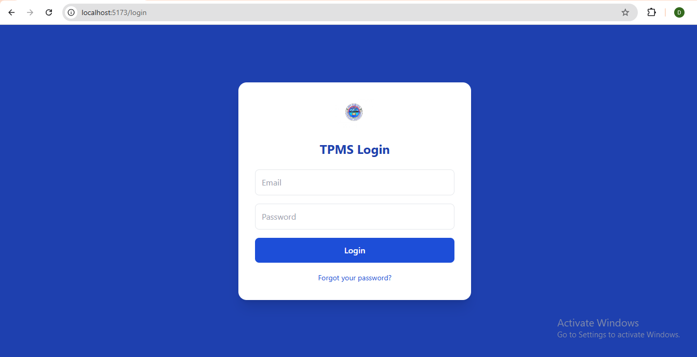
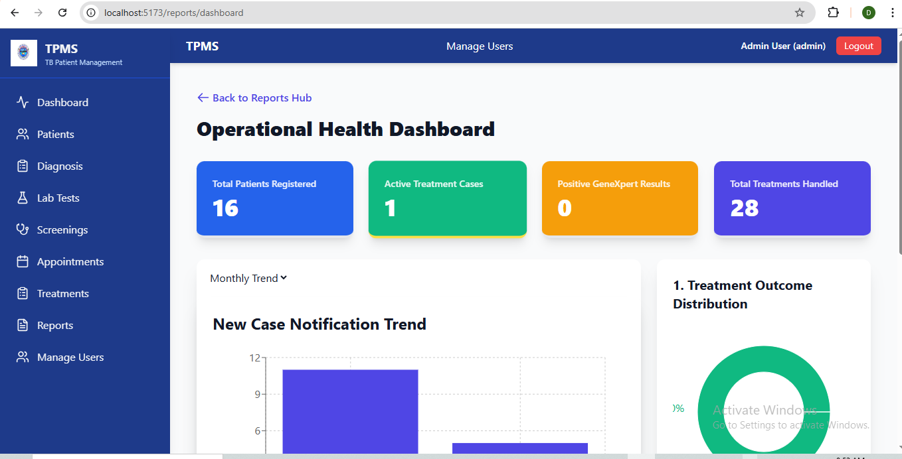
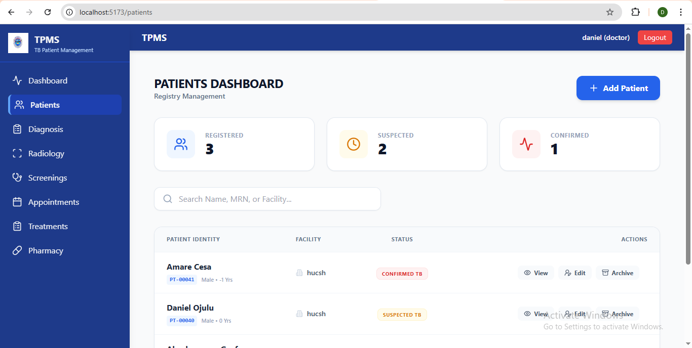

🩺 TPMS: Tuberculosis Patient Management System
A robust, Full-Stack clinical ecosystem engineered to digitize and streamline the end-to-end care of Tuberculosis patients.

📖 About the Project
Tuberculosis care involves complex, long-term data lifecycles—from initial screening and radiology to lab testing and pharmacy dispensing. TPMS was developed to solve the problem of fragmented medical records.

By integrating multiple clinical departments into a single, high-performance platform, this system ensures data integrity, reduces clinical errors, and provides healthcare professionals with real-time insights into patient recovery. It is a production-ready solution that demonstrates the power of the MERN Stack in a mission-critical healthcare context.

📊 Visuals & Screenshots

### Secure-Authentication

### Dashboard

### PaientDashboard

🚀 Key Features
Comprehensive Patient Profiles: Centralized records for medical history, demographics, and longitudinal care.

Departmental Integration: Specialized modules for Radiology (X-Ray/CT interpretations), Pharmacy, and Laboratory results.

Role-Based Access Control (RBAC): Granular security for Admins, Doctors, Nurses, and Lab Staff via JWT authentication.

Advanced Analytics: Interactive dashboards using React visualization tools to monitor treatment trends.

Standardized Workflows: Automated clinical screening to ensure consistent patient monitoring.

Responsive UI: Optimized with Tailwind CSS for both desktop and tablet use in medical environments.

🛠️ Tech Stack
Frontend
React.js: Component-based UI architecture.

Redux Toolkit: Centralized state management for complex clinical data flow.

Tailwind CSS: Utility-first styling for high-speed, modern UI development.

Lucide React: Professional medical iconography.

Backend
Node.js & Express: Scalable RESTful API development using modern ES Modules.

MongoDB & Mongoose: Flexible NoSQL schema design for evolving medical data.

JWT & Bcrypt: Secure session management and password hashing.

🏗️ System Architecture
The system follows a modular architecture for maximum scalability:

1. Client Layer: React/Redux SPA for a snappy, zero-refresh user experience.

2. API Layer: Secure REST endpoints with custom middleware for role validation.

3. Service Layer: Separated business logic to keep controllers lean and maintainable.

4. Data Layer: Optimized MongoDB collections with Mongoose schema validation.

⚙️ Installation & Setup
Prerequisites
Node.js (v18 or higher)

MongoDB Atlas account or local MongoDB instance

1. Clone the Repository

git clone https://github.com/yourusername/tpms_clone.git
cd tpms_clone

2. Backend Setup

cd server
npm install
Create a .env file in the server folder:
PORT=5000
MONGO_URI=your_mongodb_connection_string
JWT_SECRET=your_secret_key
Start the server:

3. Frontend Setup

cd client
npm install
Start the application:

npm run dev

📧 Contact
Daniel Okweir – https://www.linkedin.com/in/daniel-okweir-12b90621b/